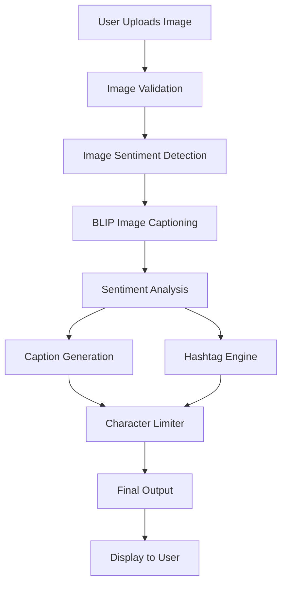

# Social Mood Matcher – AI Caption & Hashtag Generator

<div align="center">


**Production-ready Streamlit application for generating AI-powered social media captions with sentiment detection and trending hashtags.**

[Features](#features) • [Installation](#installation) • [Usage](#usage) • [Architecture](#architecture) • [Deployment](#deployment)

</div>

---

## 🎯 Overview

**Social Mood Matcher** is an end-to-end AI application that analyzes images (scenery or food), detects their sentiment/vibe, and generates engaging social media captions with trending 2024 hashtags. The application ensures all output fits within platform character limits (Twitter/X, Instagram, Facebook).

### Key Features

- 🎭 **Image Sentiment Detection** - Analyzes images to infer mood (cozy, happy, aesthetic, calm, luxury, adventurous, etc.)
- ✍️ **Smart Caption Generation** - Creates engaging captions in multiple styles (casual, aesthetic, professional, playful)
- #️⃣ **Trending Hashtag Engine** - Curated 2024 hashtags organized by category and sentiment
- 📏 **Character Limiting** - Smart truncation for Twitter/X (280 chars), Instagram, and Facebook
- 🎨 **Beautiful UI** - Modern, responsive Streamlit interface
- 🚀 **Production Ready** - Modular architecture, error handling, and deployment-ready

---

## 📸 Screenshots

### Main Interface


### Results Display


---

## 🏗️ Architecture



### Project Structure

```
social-mood-matcher/
│
├── app.py                      # Main Streamlit application
├── requirements.txt            # Python dependencies
├── README.md                   # This file
├── .env.example               # Environment template
│
├── config/
│   └── settings.py            # Centralized configuration
│
├── services/
│   ├── image_sentiment.py     # Sentiment detection service
│   ├── caption_generator.py   # Caption generation service
│   ├── hashtag_engine.py      # Hashtag recommendation engine
│   └── character_limiter.py   # Character limiting service
│
├── utils/
│   ├── image_utils.py         # Image processing utilities
│   └── text_utils.py          # Text processing utilities
│
├── assets/
│   └── sample_images/         # Sample test images
│
└── tests/
    └── test_pipeline.py       # Test suite
```

---

## 🚀 Installation

### Prerequisites

- Python 3.10 or higher
- pip package manager
- 4GB+ RAM (for AI models)

### Step 1: Clone or Download

```bash
cd "c:\Users\prana\OneDrive\Desktop\Kitchen Vision"
```

### Step 2: Create Virtual Environment (Recommended)

```bash
python -m venv venv

# Windows
venv\Scripts\activate

# Linux/Mac
source venv/bin/activate
```

### Step 3: Install Dependencies

```bash
pip install -r requirements.txt
```

**Note:** First-time installation will download AI models (~2GB). This is a one-time process.

### Step 4: Configure Environment (Optional)

```bash
copy .env.example .env
# Edit .env if you want to customize settings
```

---

## 💻 Usage

### Running the Application

```bash
streamlit run app.py
```

The application will open in your default browser at `http://localhost:8501`

### Using the Application

1. **Upload Image** - Click "Browse files" and select an image (JPG, PNG, WEBP)
2. **Configure Settings** - Choose caption style, platform, and number of hashtags in the sidebar
3. **Generate** - Click "🚀 Generate Caption & Hashtags"
4. **Copy & Share** - Copy the generated content and paste it on your social media!

### Caption Styles

- **Casual** - Friendly and relaxed tone with moderate emoji usage
- **Aesthetic** - Artistic and poetic with minimal emojis
- **Professional** - Polished and informative with no emojis
- **Playful** - Fun and energetic with high emoji usage

### Supported Platforms

- **Twitter/X** - 280 character limit
- **Instagram** - 2,200 character limit
- **Facebook** - 63,206 character limit

---

## 🧠 AI Models

The application uses the following Hugging Face models:

| Component | Model | Purpose |
|-----------|-------|---------|
| Image Captioning | Salesforce/blip-image-captioning-base | Understand image content |
| Sentiment Analysis | distilbert-base-uncased-finetuned-sst-2-english | Detect sentiment |
| Caption Templates | Custom template system | Generate engaging captions |

**All models run locally** - no API keys required!

---

## 🧪 Testing

Run the test suite:

```bash
pytest tests/test_pipeline.py -v
```

Run with coverage:

```bash
pytest tests/test_pipeline.py --cov=. --cov-report=html
```

---

## 🌐 Deployment

### Streamlit Cloud (Recommended)

1. Push your code to GitHub
2. Go to [share.streamlit.io](https://share.streamlit.io)
3. Connect your repository
4. Deploy!

### Docker Deployment

Create a `Dockerfile`:

```dockerfile
FROM python:3.10-slim

WORKDIR /app

COPY requirements.txt .
RUN pip install --no-cache-dir -r requirements.txt

COPY . .

EXPOSE 8501

CMD ["streamlit", "run", "app.py", "--server.port=8501", "--server.address=0.0.0.0"]
```

Build and run:

```bash
docker build -t social-mood-matcher .
docker run -p 8501:8501 social-mood-matcher
```

### AWS/GCP/Azure

The application can be deployed on any cloud platform that supports Python and Streamlit. See [Streamlit deployment docs](https://docs.streamlit.io/streamlit-community-cloud/get-started/deploy-an-app) for detailed guides.

---

## ⚙️ Configuration

### Environment Variables

Create a `.env` file from `.env.example`:

```bash
# Debug Settings
DEBUG=False
LOG_LEVEL=INFO

# Model Cache Directory
MODEL_CACHE_DIR=./models_cache

# Optional API Keys (for future features)
# OPENAI_API_KEY=your_key_here
# HUGGINGFACE_API_KEY=your_key_here
```

### Customizing Settings

Edit `config/settings.py` to customize:

- Model configurations
- Character limits
- Hashtag counts
- UI settings
- Sentiment categories
- Caption styles

---

## 📊 Performance

- **First Run:** ~30-60 seconds (model loading)
- **Subsequent Runs:** ~3-5 seconds per image
- **Model Size:** ~2GB (cached locally)
- **Memory Usage:** ~2-4GB RAM

**Optimization Tips:**
- Use GPU if available (change `device` in `config/settings.py`)
- Enable caching (enabled by default)
- Reduce image size before upload

---

## 🔮 Future Enhancements

- [ ] Multiple caption variants with A/B testing
- [ ] Download caption as .txt file
- [ ] Light/Dark UI mode toggle
- [ ] Real-time trending hashtag API integration
- [ ] Multi-language support
- [ ] Batch processing for multiple images
- [ ] Custom hashtag suggestions
- [ ] Analytics dashboard
- [ ] Social media direct posting
- [ ] Video support

---

## 🤝 Contributing

Contributions are welcome! Please follow these steps:

1. Fork the repository
2. Create a feature branch (`git checkout -b feature/AmazingFeature`)
3. Commit your changes (`git commit -m 'Add some AmazingFeature'`)
4. Push to the branch (`git push origin feature/AmazingFeature`)
5. Open a Pull Request

---

## 📝 License

This project is licensed under the MIT License - see the LICENSE file for details.

---

## 🙏 Acknowledgments

- [Hugging Face](https://huggingface.co/) for amazing AI models
- [Streamlit](https://streamlit.io/) for the beautiful framework
- [Salesforce](https://github.com/salesforce/BLIP) for BLIP model
- The open-source community

---

## 📧 Contact

For questions, suggestions, or issues:

- **GitHub Issues:** [Create an issue](https://github.com/yourusername/social-mood-matcher/issues)
- **Email:** your.email@example.com

---

<div align="center">

**Made with ❤️ using Streamlit & Hugging Face Transformers**

⭐ Star this repo if you find it helpful!

</div>
